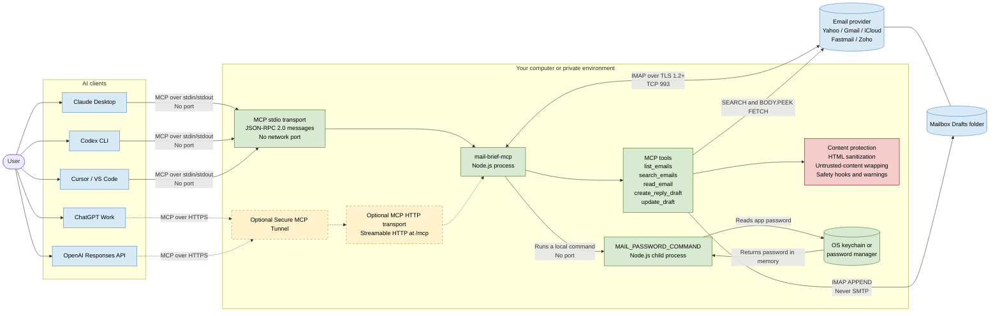

# Architecture

`mail-brief-mcp` is a local, least-privilege Model Context Protocol (MCP) server. It lets an AI assistant read and search email and create reviewable reply drafts without giving the assistant the ability to send mail.

The current implementation uses MCP over standard input/output (`stdio`). It does not open an HTTP server or listen on a network port. Its only network connection is outbound IMAP traffic to the configured mail provider.

## System diagram

Solid lines and green components are implemented today. Dashed lines and yellow components show the optional work needed for hosted ChatGPT or OpenAI API access.



## Connections, protocols, and ports

| From | To | Technology or protocol | Port | Direction |
|---|---|---|---:|---|
| Claude Desktop, Codex CLI, Cursor, or VS Code | `mail-brief-mcp` | MCP/JSON-RPC messages over process `stdin` and `stdout` | None | Local, bidirectional |
| `mail-brief-mcp` | Password store | Child process running `MAIL_PASSWORD_COMMAND` | None | Local |
| `mail-brief-mcp` | Mail provider | IMAP protected by TLS 1.2 or later | TCP 993 by default | Outbound |
| `mail-brief-mcp` | SMTP server | Not implemented | None | No connection |
| ChatGPT or OpenAI API | Optional HTTP MCP endpoint | MCP Streamable HTTP over HTTPS | Normally TCP 443 | Not implemented yet |

`IMAP_PORT` can override port 993. `IMAP_TLS=false` exists for local test servers and should not be used with a real provider.

## Components

### User

The user asks an AI client to summarize, search, or read email, or to prepare a reply. The user remains responsible for reviewing and sending drafts from their regular mail application.

### MCP host and client

Claude Desktop, Codex CLI, Cursor, or VS Code acts as both:

- the **host**, which starts and supervises the local Node.js process; and
- the **MCP client**, which discovers the server's tools and calls them on behalf of the model.

The host launches `node src/server.js`. The two processes exchange MCP messages through private operating-system pipes. Because this connection uses `stdio`, no local TCP port needs to be opened.

### MCP transport

[`StdioServerTransport`](src/server.js) connects the MCP SDK to the process's standard input and output streams. MCP uses JSON-RPC-style request and response messages to perform operations such as listing available tools and calling a selected tool.

Diagnostic output goes to standard error so that it does not corrupt the MCP message stream on standard output.

### MCP server

[`src/server.js`](src/server.js) is the application entry point and orchestration layer. It:

- loads settings from `.env`;
- refuses plain-text password environment variables;
- publishes the available MCP tool schemas;
- validates tool inputs;
- invokes the appropriate email operation;
- parses MIME messages;
- applies content sanitization and safety hooks; and
- returns MCP text results or structured tool errors.

When `READ_ONLY=true`, the server removes both draft tools from discovery and rejects attempts to call them.

### MCP tools

The server exposes five focused operations:

| Tool | Purpose | Mailbox effect |
|---|---|---|
| `list_emails` | Lists recent message metadata | Read-only |
| `search_emails` | Searches sender, subject, and message body | Read-only |
| `read_email` | Returns sanitized, human-visible message text | Read-only |
| `create_reply_draft` | Creates a reply tied to an existing message | Adds a message to Drafts |
| `update_draft` | Replaces the text of a draft previously created by this server | Adds a replacement and may remove the previous version |

There are deliberately no tools for sending, forwarding, deleting, archiving, flagging, downloading attachments, or composing to arbitrary recipients.

### IMAP client and connection manager

[`src/mail.js`](src/mail.js) uses the `imap` package to communicate with the provider. It maintains one authenticated connection and serializes tool calls because IMAP connections are stateful and each call may select a different folder.

Important behaviors include:

- TLS certificate validation and a minimum TLS version of 1.2;
- one shared authenticated connection;
- exclusive connection leases for individual tool calls;
- an idle logout after five minutes by default;
- a lease timeout that closes an abnormally long-running connection; and
- password cache invalidation after an authentication failure.

Reading uses `BODY.PEEK`, which avoids marking fetched messages as read.

### MIME parsing and draft construction

The `mailparser` package parses raw MIME messages into headers, visible body alternatives, and attachment metadata.

The `nodemailer` `MailComposer` class constructs standards-compliant raw reply messages, including `In-Reply-To` and `References` headers. Nodemailer is used only as a message builder. This project never creates an SMTP connection.

Drafts are stored with IMAP `APPEND` and the `\\Draft` flag. The server adds an `X-Mail-Brief-Draft` marker and only permits `update_draft` to modify drafts bearing that marker.

### Credential command and password store

The password is not stored in `.env`. `MAIL_PASSWORD_COMMAND` names a local command that prints the app password, for example:

- macOS `security` for Keychain;
- the included Windows Credential Manager script;
- `op` for 1Password;
- `secret-tool` for a Linux keyring; or
- `pass` for the Unix password store.

Node.js runs the command as a child process, removes its trailing newline, and keeps the resulting password only in memory. Command output is never included in an error message because it could contain the secret.

An app password can still grant broader mailbox access than this server exposes. Use a dedicated app password and rotate it periodically.

### Email provider

The provider is selected with `IMAP_HOST`; Yahoo's `imap.mail.yahoo.com` is the default. Standard app-password-based IMAP providers should work. Outlook and Microsoft 365 require OAuth and are not currently supported.

All provider communication is outbound IMAP over TLS, normally on TCP port 993.

### Content sanitization and prompt-injection boundary

[`src/untrusted.js`](src/untrusted.js) treats every sender-controlled field as untrusted. It:

- removes scripts, comments, hidden HTML, invisible Unicode, and control characters;
- converts visible HTML to plain text;
- prefers the HTML part that a mail application would display;
- limits the amount of message text returned;
- neutralizes forged `untrusted-content` markers; and
- wraps sender-controlled content in blocks with random identifiers.

These controls reduce prompt-injection risk but cannot guarantee that a model will never be influenced by malicious text. The strongest protection is the server's limited tool set: even a misled model cannot send mail or delete messages through this MCP server.

### Safety hooks

[`src/safety.js`](src/safety.js) performs checks outside the untrusted sender-content boundary. Built-in checks warn about:

- mismatched `Reply-To` addresses;
- display-name impersonation;
- changed payment or bank details;
- wire transfers, gift cards, and cryptocurrency requests;
- Indian payment and identity scams involving UPI, IFSC, OTP, PIN, CVV, KYC, PAN, or Aadhaar; and
- urgent payment pressure.

`SAFETY_HOOKS_MODULE` can load organization-specific JavaScript hooks. If a custom hook throws an error, the operation fails closed.

## Read request flow

For a request such as “Summarize today's unread emails”:

1. The user sends the request to the AI client.
2. The model selects `list_emails`, `search_emails`, or `read_email`.
3. The MCP client sends a tool-call message over `stdio`.
4. The server validates the arguments before connecting to email.
5. The server runs `MAIL_PASSWORD_COMMAND` if no password is cached.
6. The IMAP client establishes or reuses a TLS connection to the provider on port 993.
7. The server selects the requested folder and performs IMAP `SEARCH` and `FETCH` operations.
8. MIME content is parsed and reduced to what a human reader would see.
9. Safety checks run and sender content is wrapped as untrusted data.
10. The result returns through MCP to the model, which writes the summary for the user.

## Draft request flow

For a request such as “Draft a reply to Alice saying Friday works”:

1. The model identifies the original message UID.
2. It calls `create_reply_draft` with the UID and proposed reply body.
3. The server fetches the original message without marking it read.
4. Recipients, subject, and threading headers are derived from that message rather than supplied freely by the model.
5. Safety hooks inspect the destination and draft text.
6. `MailComposer` builds the raw MIME reply.
7. The server stores it in the provider's Drafts folder with IMAP `APPEND`.
8. The server reports that the message was not sent.
9. The user reviews and sends it from their mail application.

## ChatGPT and OpenAI integration

The current `stdio` transport works with clients capable of starting local MCP processes. Hosted ChatGPT cannot directly start this local Node.js process or communicate with its private `stdio` pipes.

To support ChatGPT Work or an OpenAI API application, retain the existing tools and mail logic while adding a second MCP transport:

```text
Shared mail and tool logic
├── stdio transport       Claude Desktop, Codex CLI, Cursor, VS Code
└── Streamable HTTP /mcp  ChatGPT Work and OpenAI API
```

The HTTP endpoint would need to be reachable through one of these approaches:

1. **Secure MCP Tunnel:** keep the server private and connect it through an authenticated tunnel. This is the preferred direction for a personal mailbox.
2. **Public HTTPS deployment:** deploy `/mcp` on a public server, with strong authentication and strict per-user mailbox isolation.
3. **Development tunnel:** temporarily expose a local HTTP endpoint for testing. This should not be treated as a production security design.

Adding HTTP changes the threat model. Before doing so, the project should add authentication, authorization, request limits, audit logging that excludes secrets and email bodies, and protection against cross-user access.

## Trust boundaries

| Boundary | Main risk | Protection |
|---|---|---|
| AI client → MCP server | Overly broad model actions | Small tool set, input validation, optional `READ_ONLY` mode |
| Email sender → model | Prompt injection and deceptive content | Visible-text filtering, untrusted blocks, safety warnings |
| Server → password store | Credential disclosure | Command-based retrieval, memory-only caching, sanitized errors |
| Server → mail provider | Credential or message interception | TLS 1.2+, certificate validation |
| Draft tool → mailbox | Unintended outgoing communication | Draft-only behavior; no SMTP or send tool |
| Hosted ChatGPT → private server | Public exposure and unauthorized access | Not enabled currently; use authentication and a secure tunnel |

## Key architectural decisions

### Local `stdio` rather than HTTP

This keeps the current deployment simple and avoids opening a listening port. The trade-off is that remotely hosted clients such as ChatGPT require an additional transport or tunnel.

### IMAP rather than provider-specific APIs

IMAP makes the server usable with several providers through one implementation. The trade-off is reliance on app passwords; providers that require OAuth are unsupported.

### Draft-only writes

Allowing reply drafts provides practical assistance while reserving the irreversible send action for the user. It also sharply limits the impact of prompt injection.

### One shared IMAP connection

Reusing the connection reduces login overhead. A lock is necessary because IMAP folder selection is connection state, so concurrent calls could otherwise interfere with each other.

### Server-enforced restrictions

Safety does not depend only on instructions given to the model. Unsupported actions have no MCP tool or SMTP implementation, and draft updates are restricted to messages marked as created by this server.

## Configuration summary

| Variable | Purpose | Default |
|---|---|---|
| `MAIL_ADDRESS` | IMAP login and draft sender | Required |
| `MAIL_PASSWORD_COMMAND` | Reads the app password from a secure store | Required |
| `IMAP_HOST` | Provider's IMAP hostname | `imap.mail.yahoo.com` |
| `IMAP_PORT` | Provider's IMAP TCP port | `993` |
| `IMAP_TLS` | Enables TLS | `true` |
| `DRAFTS_FOLDER` | Overrides automatic Drafts-folder discovery | Auto-detected |
| `READ_ONLY` | Removes draft tools | `false` |
| `READ_EMAIL_MAX_CHARS` | Maximum returned body length per message | `20000` |
| `SEARCH_SCAN_LIMIT` | Maximum whole-word search candidates inspected | `100` |
| `SAFETY_HOOKS_MODULE` | Loads custom safety hooks | Not set |
| `IMAP_IDLE_MS` | Delay before idle logout | `300000` ms |
| `IMAP_LEASE_TIMEOUT_MS` | Maximum exclusive connection lease | `300000` ms |
| `ENV_FILE` | Settings file relative to the project root | `.env` |

